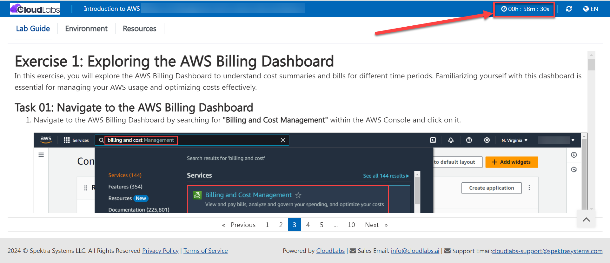
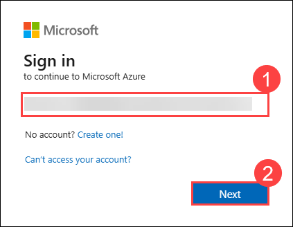

# Access Guidelines for Sandbox Environments

Before starting your testing activities, kindly note that the **lab duration** will be displayed at the top right corner of your lab environment page once you click the **Launch Lab** button. The timer will start automatically, so please keep track of your remaining time while working in the sandbox.

Follow the steps below to access and utilize the sandbox environment effectively.

---

### 1. Sign In to the CloudLabs Environment

1. Sign in to the AWS Management Console by copying the **Sign-in link, Username, and Password** provided below.

    * **Sign-in Link**: **<inject key="SignInUrl" enableCopy="true" />**

    * **IAM Username**: **<inject key="UserName" enableCopy="true" />**

    * **Password**: **<inject key="Password" enableCopy="true" />**

   

   Alternatively, you can access the same details from the **CloudLabs** interface as shown below.

   

---

### 2. Select the Correct Region

After signing in, choose the region **US-EAST-1 (N. Virginia)** from the region selector at the top-right corner of the AWS Management Console.

> **Note:**
> The sandbox environment is configured primarily for the **US-EAST-1 (N. Virginia)** region.
> Some services may not be available or may fail to deploy in other regions, so always ensure you are operating within **US-EAST-1** unless explicitly instructed otherwise

### **Best Practices**

- **Resource Usage:**
Ensure to stop or terminate EC2 instances, RDS databases, Lambda functions, and other compute resources when not in use to prevent unnecessary AWS credit consumption. Also, delete unused EBS volumes, snapshots, and Elastic IPs to minimize ongoing costs.

- **AWS Cost Explorer:**
Regularly review your usage and spending through **AWS Cost Explorer** or **Billing Dashboard** to track resource costs and ensure efficient utilization of your sandbox environment over time.

## Common Troubleshooting

Here are few common issues and fix which you might encounter while performing the lab.

- VM Remote connection issue: RDP: [Known Functionality Issues | CloudLabs Documentation](https://docs.cloudlabs.ai/Learner/Troubleshooting/RDP/)

- Copy Paste Issue: [Copy Paste | CloudLabs Documentation](https://docs.cloudlabs.ai/Learner/Troubleshooting/CopyPaste/)

## CloudLabs Support Contacts:
You can reach out to the support team in case you face any difficulty in using the sandbox environment, any permission, or Azure consumption-related queries.

* Sandbox user Email Support:  cloudlabs-support@spektrasystems.com
* Sandbox user Live Chat Support: https://cloudlabs.ai/ms-support
